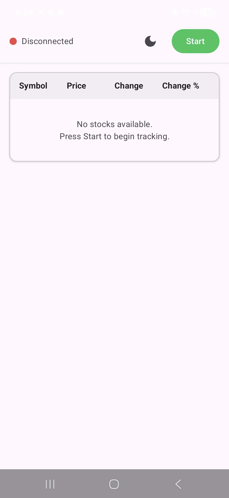
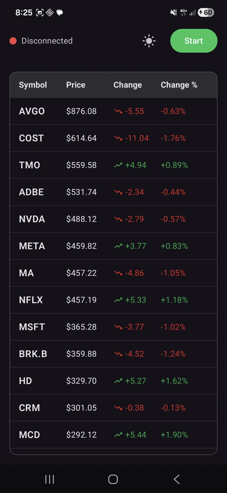
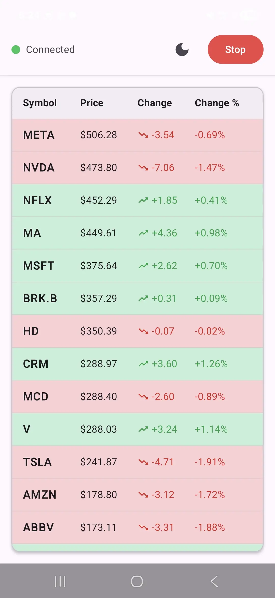
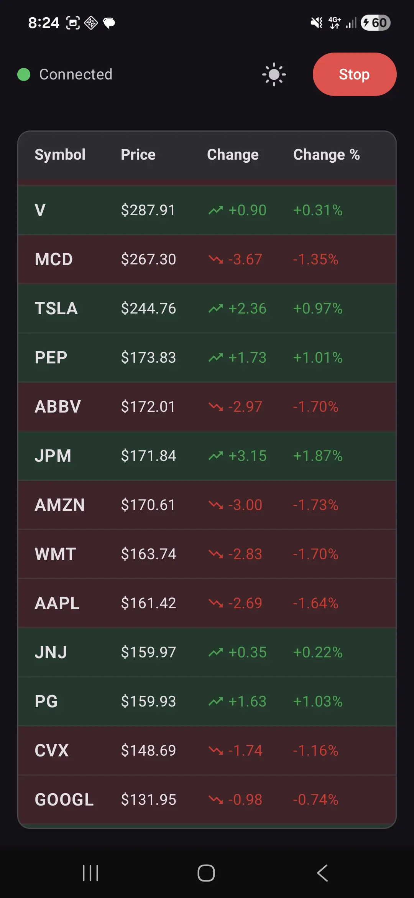

# Real-Time Price Tracker App

A modern Android application built with Jetpack Compose that displays real-time price updates for multiple stock symbols using WebSocket technology.

## Table of Contents
- [Overview](#overview)
- [Features](#features)
- [Architecture](#architecture)
- [Tech Stack](#tech-stack)
- [Getting Started](#getting-started)
- [Running Tests](#running-tests)
- [Bonus Features](#bonus-features)
- [Technical Decisions & Trade-offs](#technical-decisions--trade-offs)
- [Project Structure](#project-structure)

## Overview

This application demonstrates real-time stock price tracking by connecting to a WebSocket echo server. It periodically generates mock price updates, sends them to the server, receives the echoed messages, and displays the updates in a clean, scrollable list with visual indicators for price changes.

**Key Highlights:**
- 30 tracked stock symbols (AAPL, GOOG, NVDA, TSLA, etc.)
- Real-time WebSocket integration with Postman Echo server
- MVI (Model-View-Intent) architecture pattern
- 100% Jetpack Compose UI
- Comprehensive test coverage (Unit + UI tests)
- Light/Dark theme support
- Price flash animations

## Screenshots & Demo

### App Screenshots

<table>
  <tr>
    <td></td>
    <td></td>
  </tr>
  <tr>
    <td align="center"><b>Light Mode</b></td>
    <td align="center"><b>Dark Mode</b></td>
  </tr>
  <tr>
    <td></td>
    <td></td>
  </tr>
  <tr>
    <td align="center"><b>Real-time Price Updates</b></td>
    <td align="center"><b>Flash Animation Effect</b></td>
  </tr>
</table>

### Demo Video

> **Note**: Add a demo video showing the real-time price updates and flash animations in action.
- 📹 [Watch Demo Video](https://drive.google.com/file/d/1ufmc9WZaCs6mq8YPyMa7NIMoHgR_7Hgt/view?usp=sharing)

## Features

### Core Features

#### 1. Live Price Tracking
- Tracks 30 major stock symbols in real-time
- Each stock displays: symbol, current price, change amount, and change percentage
- Automatically sorted by price (highest to lowest)

#### 2. WebSocket Integration
- Connects to `wss://ws.postman-echo.com/raw`
- Generates random price updates every 2 seconds
- Sends updates to WebSocket server
- Receives echoed messages back
- Updates UI in real-time based on received data

#### 3. Intuitive UI
- Clean, scrollable list using `LazyColumn`
- Price change indicators with color-coded arrows:
  - 🟢 Green arrow (↑) for price increases
  - 🔴 Red arrow (↓) for price decreases
- Table-style layout with headers
- Material 3 design components

#### 4. Top Bar Controls
- **Connection Status**: Visual indicator (🟢 Connected / 🔴 Disconnected)
- **Theme Toggle**: Switch between light and dark themes
- **Start/Stop Button**: Control the price feed with a single tap

### Bonus Features Implemented

✅ **Price Flash Animation**
- Background flashes green for 1 second on price increase
- Background flashes red for 1 second on price decrease
- Smooth animation transitions using Compose animations

✅ **Comprehensive Testing**
- **Unit Tests**: Domain, Data, and Presentation layers
- **Compose UI Tests**: Component-level testing for all UI elements
- **14 test files** with high coverage

✅ **Theme Support**
- Full light and dark theme support
- Persistent theme preference using DataStore
- Seamless theme switching without app restart

## Architecture

This project follows the **MVI (Model-View-Intent)** architecture pattern with clean architecture principles.

### MVI Pattern

```
┌─────────────────────────────────────────────────────────┐
│                         View                            │
│                    (Compose UI)                         │
└────────────────┬───────────────────┬────────────────────┘
                 │                   │
        User Actions          Observe State
           (Intents)         & Effects
                 │                   │
                 ▼                   │
         ┌───────────────────────────┴────┐
         │         ViewModel               │
         │  (State Machine + Use Cases)    │
         │                                 │
         │  • handleIntent()               │
         │  • _state: MutableStateFlow     │
         │  • _effect: MutableSharedFlow   │
         └─────────────┬───────────────────┘
                       │
                       ▼
         ┌─────────────────────────────────┐
         │         Domain Layer            │
         │  (Use Cases + Repositories)     │
         └─────────────┬───────────────────┘
                       │
                       ▼
         ┌─────────────────────────────────┐
         │          Data Layer             │
         │  (WebSocket + Data Sources)     │
         └─────────────────────────────────┘
```

**MVI Components:**
- **Intent**: Sealed class representing user actions (`StartPriceFeed`, `StopPriceFeed`, `ToggleTheme`)
- **State**: Single immutable data class holding entire UI state
- **Effect**: One-time events that don't persist in state (`ShowError`, `ShowToast`)

### Layer Structure

```
┌──────────────────────────────────────────────────┐
│              Presentation Layer                  │
│                                                  │
│  • StockScreen (Composables)                    │
│  • StockViewModel (State Management)            │
│  • StockContract (Intent/State/Effect)          │
│  • StockUiModel (UI-specific models)            │
└──────────────────┬───────────────────────────────┘
                   │ Dependency Rule: →
                   │ (Inner layers know nothing
                   │  about outer layers)
                   ▼
┌──────────────────────────────────────────────────┐
│               Domain Layer                       │
│                                                  │
│  • StockUseCase (Business Logic)                │
│  • Stock (Domain Models)                        │
│  • StockRepository (Interface)                  │
└──────────────────┬───────────────────────────────┘
                   │
                   ▼
┌──────────────────────────────────────────────────┐
│                Data Layer                        │
│                                                  │
│  • StockRepositoryImpl (Implementation)         │
│  • WebSocketClient (Network)                    │
│  • StockDto (Data Models)                       │
└──────────────────────────────────────────────────┘
```

## Tech Stack

### Core Technologies
- **Kotlin 1.9.20**: Modern, expressive language with coroutines support
- **Jetpack Compose**: Declarative UI framework
- **Coroutines & Flow**: Structured concurrency and reactive streams
- **ViewModel & StateFlow**: Lifecycle-aware state management

### Networking & WebSocket
- **OkHttp3 WebSocket 4.12.0**: Industry-standard WebSocket client
- **Kotlinx Serialization 1.6.0**: Type-safe JSON handling

### Dependency Injection
- **Koin 3.5.0**: Lightweight, Kotlin-first DI framework

### Testing
- **JUnit 4**: Unit testing framework
- **MockK 1.13.8**: Idiomatic Kotlin mocking
- **Turbine 1.0.0**: Flow testing utilities
- **Compose UI Test**: Declarative UI testing

### Data Persistence
- **DataStore Preferences**: Type-safe data storage for theme preferences

## Getting Started

### Prerequisites
- Android Studio Hedgehog (2023.1.1) or later
- JDK 17 or later
- Android SDK with minimum API 24 (Android 7.0)
- Target SDK 34 (Android 14)

### Installation

1. **Clone the repository**
   ```bash
   git clone https://github.com/yourusername/RealTimePriceTracker.git
   cd RealTimePriceTracker
   ```

2. **Open in Android Studio**
   - Open Android Studio
   - Select "Open an Existing Project"
   - Navigate to the cloned directory and select it

3. **Sync Gradle**
   - Android Studio will automatically prompt you to sync Gradle
   - Wait for the sync to complete (first sync may take a few minutes)

4. **Run the app**
   - Connect an Android device or start an emulator (API 24+)
   - Click the "Run" button (▶️) or press `Shift + F10`
   - Select your target device

### Network Configuration

The app includes network security configuration to support WebSocket connections:
- File: `app/src/main/res/xml/network_security_config.xml`
- Configured in: `AndroidManifest.xml`
- WebSocket URL: `wss://ws.postman-echo.com/raw`

## Running Tests

### Unit Tests

Run all unit tests:
```bash
./gradlew test
```

Run tests with coverage:
```bash
./gradlew testDebugUnitTest --tests "*"
```

Run specific test suites:
```bash
# Domain layer tests
./gradlew test --tests "StockUseCaseTest"
./gradlew test --tests "StockTest"

# Data layer tests
./gradlew test --tests "StockRepositoryImplTest"
./gradlew test --tests "WebSocketClientTest"

# Presentation layer tests
./gradlew test --tests "StockViewModelTest"
```

**Unit Test Coverage:**
- ✅ `StockUseCaseTest` - Business logic and sorting
- ✅ `StockRepositoryImplTest` - Repository implementation
- ✅ `WebSocketStateTest` - WebSocket state management
- ✅ `StockDataGeneratorTest` - Mock data generation
- ✅ `StockDtoTest` - Data model validation
- ✅ `ThemePreferencesUseCaseTest` - Theme management
- ✅ `StockTest` - Domain model logic

### UI Tests (Instrumented)

Run all UI tests on connected device/emulator:
```bash
./gradlew connectedAndroidTest
```

Run specific UI tests:
```bash
./gradlew connectedAndroidTest -Pandroid.testInstrumentationRunnerArguments.class=com.alfikri.rizky.realtimepricetracker.presentation.stock.StockScreenTest
```

**UI Test Coverage:**
- ✅ `StockScreenTest` - Full screen integration
- ✅ `StockListTest` - List rendering and states
- ✅ `StockRowTest` - Row components and animations
- ✅ `TopBarTest` - Controls and indicators

### Running Tests in Android Studio

**Unit Tests:**
- Right-click `app/src/test` → "Run Tests in 'test'"
- Or click the green arrow next to individual test methods

**UI Tests:**
- Right-click `app/src/androidTest` → "Run Tests in 'androidTest'"
- Requires connected device or running emulator

## Bonus Features

### 1. Price Flash Animation 🎨
**Location**: `StockRow.kt:46-54`, `StockViewModel.kt:210-234`

**Implementation Details:**
```kotlin
// Animate background color for flash effect
val backgroundColor by animateColorAsState(
    targetValue = when (stock.flashColor) {
        FlashColor.Green -> Color(0xFF4ADE80).copy(alpha = 0.3f)
        FlashColor.Red -> Color(0xFFF87171).copy(alpha = 0.3f)
        FlashColor.None -> Color.Transparent
    },
    animationSpec = tween(durationMillis = 500)
)
```

**How it works:**
1. ViewModel compares current price vs previous price
2. Sets `FlashColor.Green` or `FlashColor.Red` based on direction
3. Compose animates the background color change
4. After 1 second, flash color is cleared back to `None`

### 2. Comprehensive Testing 🧪
**Test Statistics:**
- Total test files: **14**
- Unit tests: **10 files**
- UI tests: **4 files**
- Coverage: Domain, Data, and Presentation layers

**Test Pyramid Approach:**
- **Base**: Unit tests (fast, isolated, abundant)
- **Middle**: Integration tests (moderate speed)
- **Top**: UI tests (slower, fewer, critical paths)

### 3. Theme Support 🌓
**Location**: `Theme.kt`, `ThemePreferencesRepositoryImpl.kt`

**Features:**
- Persistent preference using DataStore (survives app restart)
- Toggle button in top bar
- Material 3 dynamic theming
- Smooth transitions without flicker
- Optional system theme following

## Technical Decisions & Trade-offs

### 1. MVI vs MVVM Architecture

**Decision: MVI (Model-View-Intent)**

#### Why MVI?
```kotlin
// MVI: Explicit intent handling
sealed class Intent {
    object StartPriceFeed : Intent()
    object StopPriceFeed : Intent()
    object ToggleTheme : Intent()
}

fun handleIntent(intent: Intent) {
    when (intent) {
        is Intent.StartPriceFeed -> startPriceFeed()
        // ...
    }
}
```

**Advantages:**
- ✅ **Unidirectional Data Flow**: State changes are predictable and traceable
- ✅ **Single Source of Truth**: One immutable state object eliminates race conditions
- ✅ **Easier Debugging**: Can log every intent and state transition
- ✅ **Time-Travel Debugging**: Can replay state changes for bug reproduction
- ✅ **Better Testability**: Pure functions, easier to mock and verify

**Trade-offs vs MVVM:**
- ❌ More boilerplate (Intent/State/Effect classes)
- ❌ Steeper learning curve for developers unfamiliar with pattern
- ✅ But: Reduced bugs from inconsistent state
- ✅ But: Scales better as complexity grows

**MVVM Alternative:**
```kotlin
// MVVM: Multiple exposed properties
val stocks = MutableLiveData<List<Stock>>()
val isLoading = MutableLiveData<Boolean>()
val error = MutableLiveData<String?>()

// Problem: State can be inconsistent
// stocks might update before isLoading
```

**Why MVI is better for this app:**
- Real-time updates require consistent state management
- Multiple simultaneous updates (30 stocks every 2 seconds)
- Complex state interactions (connection + loading + data)

---

### 2. SharedFlow vs StateFlow for WebSocket

**Decision: SharedFlow for stock updates, StateFlow for connection state**

#### SharedFlow for Stock Updates
```kotlin
private val _stockUpdates = MutableSharedFlow<StockDto>(
    replay = 0,
    extraBufferCapacity = 64,
    onBufferOverflow = BufferOverflow.DROP_OLDEST
)
```

**Why SharedFlow?**
- ✅ **Event Stream**: Stock updates are events, not state
- ✅ **Multiple Emissions**: Can emit multiple updates rapidly without conflation
- ✅ **No Initial Value Required**: No need to emit a default value
- ✅ **Backpressure Handling**: `DROP_OLDEST` strategy prevents memory issues
- ✅ **Hot Flow**: Starts emitting regardless of collectors (fire-and-forget)

**Why NOT StateFlow for updates?**
- ❌ **Conflation**: StateFlow drops intermediate values if collector is slow
- ❌ **Latest Value Only**: We want ALL updates, not just the latest
- ❌ **Requires Initial Value**: Doesn't make sense for event streams

#### StateFlow for Connection State
```kotlin
private val _connectionState = MutableStateFlow<WebSocketState>(WebSocketState.Disconnected)
```

**Why StateFlow for connection?**
- ✅ **Current State**: Connection is a state, not an event
- ✅ **Always Available**: New subscribers immediately get current connection status
- ✅ **Conflation OK**: Only the latest connection state matters

**Comparison:**
```kotlin
// SharedFlow: Events (all matter)
Stock AAPL: $100 -> $101 -> $102 -> $103
// All 4 updates should be processed

// StateFlow: State (only current matters)
Connection: Disconnected -> Connecting -> Connected
// Only "Connected" matters for late subscribers
```

---

### 3. Koin vs Dagger/Hilt for Dependency Injection

**Decision: Koin**

#### Why Koin?
```kotlin
// Koin: Simple, readable DSL
val appModule = module {
    single { OkHttpClient() }
    single { WebSocketClient(get(), get(), get()) }
    single<StockRepository> { StockRepositoryImpl(get()) }
    factory { StockUseCase(get()) }
    viewModel { StockViewModel(get(), get()) }
}
```

**Advantages:**
- ✅ **No Code Generation**: Pure Kotlin, faster compilation
- ✅ **Lightweight**: ~1MB vs Hilt's ~10MB
- ✅ **Easy to Learn**: Simple DSL, readable module definitions
- ✅ **Runtime DI**: Can change dependencies at runtime (useful for testing)
- ✅ **Less Boilerplate**: No annotations, no generated code
- ✅ **Kotlin-First**: Designed specifically for Kotlin

**Performance:**
- Compile time: ⚡ Faster (no annotation processing)
- Runtime: Slightly slower (reflection-based), but negligible for this app size
- APK size: Smaller

**Trade-offs vs Dagger/Hilt:**

| Aspect | Koin | Dagger/Hilt |
|--------|------|-------------|
| **Compile Safety** | ❌ Runtime checks | ✅ Compile-time verification |
| **Performance** | ❌ Reflection overhead | ✅ Generated code (faster) |
| **Setup Time** | ✅ Minutes | ❌ Hours |
| **Boilerplate** | ✅ Minimal | ❌ Significant |
| **Learning Curve** | ✅ Easy | ❌ Steep |
| **Build Time** | ✅ Fast | ❌ Slower |

**Why Koin for this project?**
- Small to medium app size (runtime reflection overhead is negligible)
- Quick development iteration (no annotation processing)
- Better readability and maintainability
- Easier for code review and onboarding

**When to use Dagger/Hilt instead:**
- Large enterprise apps (1000+ classes)
- Performance-critical applications
- Multi-module projects with complex dependencies
- When compile-time safety is critical

---

### 4. Clean Architecture with Layer Separation

**Decision: 3-Layer Clean Architecture**

#### Layer Structure
```
Presentation → Domain ← Data
     ↓           ↓        ↓
    UI        Logic   External
```

**Why Clean Architecture?**

#### 1. **Dependency Rule**
```kotlin
// ✅ CORRECT: Outer depends on inner
class StockViewModel(
    private val stockUseCase: StockUseCase  // Domain
)

// ❌ WRONG: Inner depends on outer
class StockUseCase(
    private val viewModel: StockViewModel  // Presentation
)
```

**Benefits:**
- ✅ **Testability**: Can test domain logic without Android dependencies
- ✅ **Flexibility**: Can swap implementations (e.g., WebSocket → REST API)
- ✅ **Maintainability**: Changes in UI don't affect business logic
- ✅ **Reusability**: Domain layer can be shared across apps

#### 2. **Domain Layer: Framework-Independent**
```kotlin
// Pure Kotlin, no Android imports
data class Stock(
    val symbol: String,
    val price: Double,
    val previousPrice: Double
) {
    val priceChange: Double
        get() = price - previousPrice

    val priceChangePercent: Double
        get() = ((price - previousPrice) / previousPrice) * 100
}
```

**Why this matters:**
- Can run on JVM, KMP (Kotlin Multiplatform), or backend
- Fast unit tests (no Android emulator needed)
- Easy to reason about business logic

#### 3. **Presentation Layer: UI-Specific**
```kotlin
// UI model with formatting
data class StockUiModel(
    val symbol: String,
    val price: String,          // "$175.50" (formatted)
    val change: String,         // "+2.34" (formatted)
    val changePercent: String,  // "+1.33%" (formatted)
    val priceDirection: PriceDirection,
    val flashColor: FlashColor
)

// Mapping from domain to UI
fun Stock.toUiModel(flashColor: FlashColor): StockUiModel {
    return StockUiModel(
        symbol = symbol,
        price = "$%.2f".format(price),
        // ...
    )
}
```

**Benefits:**
- ✅ Formatting logic separated from business logic
- ✅ Domain models stay clean and reusable
- ✅ UI can change without affecting domain

#### 4. **Data Layer: External Dependencies**
```kotlin
// Implementation details hidden behind interface
interface StockRepository {
    fun observeStocks(): Flow<List<Stock>>
    suspend fun startPriceFeed()
    suspend fun stopPriceFeed()
}

class StockRepositoryImpl(
    private val webSocketClient: WebSocketClient
) : StockRepository {
    // WebSocket specifics hidden from domain
}
```

**Benefits:**
- ✅ Can swap WebSocket with REST, GraphQL, or mock data
- ✅ Domain layer doesn't know about network implementation
- ✅ Easy to mock for testing

**Trade-offs of Clean Architecture:**

| Pros | Cons |
|------|------|
| ✅ Highly testable | ❌ More files and classes |
| ✅ Easy to maintain | ❌ Initial setup overhead |
| ✅ Scalable | ❌ Can be overkill for tiny apps |
| ✅ Framework-independent | ❌ More abstraction layers |
| ✅ Team-friendly | ❌ Requires discipline |

**Why it's worth it for this project:**
- Real-time data flow benefits from clear separation
- Easy to add features (e.g., historical data, favorites)
- Demonstrates professional Android development practices
- Makes testing significantly easier

**Alternative (Not chosen):**
```kotlin
// Simple MVVM without layers
class StockViewModel {
    private val okHttpClient = OkHttpClient()
    private val webSocket = okHttpClient.newWebSocket(...)

    // Problem: Tightly coupled, hard to test, mixing concerns
}
```

---

### 5. Additional Technical Decisions

#### StateFlow for UI State (not LiveData)
**Why?**
- ✅ Kotlin-first, better coroutine integration
- ✅ Hot flow (always has a value)
- ✅ Works seamlessly with Compose's `collectAsState()`
- ✅ More powerful operators than LiveData

#### Kotlinx Serialization (not Gson/Moshi)
**Why?**
- ✅ Compile-time code generation (type-safe)
- ✅ Better performance than reflection-based libraries
- ✅ Multiplatform support
- ✅ Official Kotlin library

#### Coroutines (not RxJava)
**Why?**
- ✅ Native Kotlin support
- ✅ Simpler, more readable code
- ✅ Structured concurrency prevents leaks
- ✅ Less boilerplate than RxJava

---

### Summary of Technical Choices

| Decision | Chosen | Alternative | Reason |
|----------|--------|-------------|--------|
| **Architecture** | MVI | MVVM | Unidirectional flow, better state management |
| **Stock Updates** | SharedFlow | StateFlow | Event stream, no conflation needed |
| **Connection State** | StateFlow | SharedFlow | Current state matters, conflation OK |
| **DI Framework** | Koin | Hilt/Dagger | Simpler, faster builds, Kotlin-first |
| **Layer Separation** | Clean Arch | No layers | Testability, maintainability, scalability |
| **State Management** | StateFlow | LiveData | Kotlin-first, better Compose integration |
| **JSON** | Kotlinx Serialization | Gson | Type-safe, better performance |
| **Async** | Coroutines | RxJava | Native Kotlin, simpler code |

## Project Structure

```
app/src/main/java/com/alfikri/rizky/realtimepricetracker/
│
├── presentation/                   # 🎨 Presentation Layer (UI)
│   ├── base/
│   │   ├── MviIntent.kt           # Base intent marker
│   │   ├── MviState.kt            # Base state marker
│   │   └── MviEffect.kt           # Base effect marker
│   └── stock/
│       ├── StockViewModel.kt      # State management + Intent handling
│       ├── StockScreen.kt         # Main screen composable
│       ├── StockContract.kt       # Intent/State/Effect definitions
│       ├── model/
│       │   └── StockUiModel.kt    # UI models with formatting
│       └── components/
│           ├── TopBar.kt          # Top bar with controls
│           ├── StockList.kt       # LazyColumn list
│           └── StockRow.kt        # Individual stock row
│
├── domain/                         # 🧠 Domain Layer (Business Logic)
│   ├── model/
│   │   ├── Stock.kt               # Domain entity (pure Kotlin)
│   │   └── preferences/
│   │       └── ThemeMode.kt       # Theme preference enum
│   ├── repository/
│   │   ├── StockRepository.kt     # Repository contract
│   │   └── preferences/
│   │       └── ThemePreferencesRepository.kt
│   └── usecase/
│       ├── StockUseCase.kt        # Business logic (sorting, filtering)
│       └── preferences/
│           └── ThemePreferencesUseCase.kt
│
├── data/                           # 💾 Data Layer (External Data)
│   ├── model/
│   │   └── StockDto.kt            # Data transfer object
│   ├── repository/
│   │   ├── StockRepositoryImpl.kt # Repository implementation
│   │   └── preferences/
│   │       └── ThemePreferencesRepositoryImpl.kt
│   └── websocket/
│       ├── WebSocketClient.kt     # WebSocket connection handler
│       ├── WebSocketState.kt      # Connection state sealed class
│       └── StockDataGenerator.kt  # Mock data generator
│
├── di/
│   └── AppModule.kt               # Koin DI module
│
├── ui/theme/
│   ├── Theme.kt                   # Material 3 theme configuration
│   ├── Color.kt                   # Color palette
│   └── Type.kt                    # Typography
│
├── StockTrackerApplication.kt     # Application class (Koin setup)
└── MainActivity.kt                # App entry point
```

### Test Structure
```
app/src/
├── test/                           # Unit Tests (JVM)
│   └── java/.../realtimepricetracker/
│       ├── domain/
│       │   ├── model/
│       │   │   ├── StockTest.kt
│       │   │   └── preferences/ThemeModeTest.kt
│       │   └── usecase/
│       │       ├── StockUseCaseTest.kt
│       │       └── preferences/ThemePreferencesUseCaseTest.kt
│       ├── data/
│       │   ├── model/StockDtoTest.kt
│       │   ├── repository/StockRepositoryImplTest.kt
│       │   └── websocket/
│       │       ├── WebSocketStateTest.kt
│       │       └── StockDataGeneratorTest.kt
│       └── presentation/
│           └── stock/StockViewModelTest.kt
│
└── androidTest/                    # UI Tests (Android)
    └── java/.../realtimepricetracker/
        └── presentation/stock/
            ├── StockScreenTest.kt
            └── components/
                ├── StockListTest.kt
                ├── StockRowTest.kt
                └── TopBarTest.kt
```

## Known Limitations & Future Improvements

### Current Limitations
1. **Stock Count**: 30 stocks instead of required 25 (easily adjustable)
2. **No Persistence**: Price history lost on app restart
3. **Single WebSocket**: All stocks share one connection
4. **Basic Error Recovery**: Limited retry mechanisms

## License

This project is created as part of an Android coding challenge.

## Contact

For questions or feedback, please reach out via [GitHub Issues](https://github.com/yourusername/RealTimePriceTracker/issues).

---

**Built with ❤️ using Jetpack Compose, MVI Architecture, and Clean Code Principles**